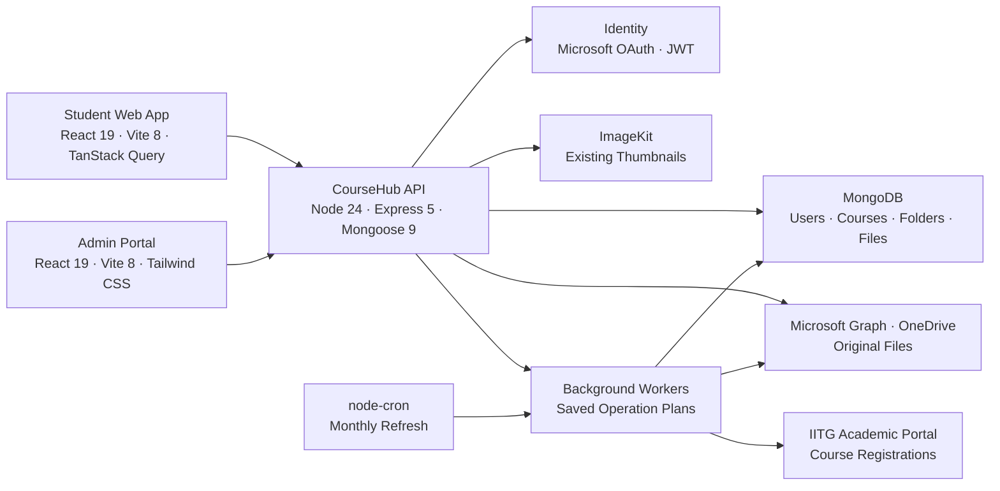

<div align="center">
  
</div>

<h1 align="center">CourseHub</h1>

<p align="center">
  IIT Guwahati's shared academic library
</p>

<p align="center">
  <a href="https://coursehub.codingclub.in"><strong>Open CourseHub</strong></a>
  ·
  <a href="https://codingclub.in/blog/meet-coursehub-find-share-and-organise-course-material">Read the guide</a>
</p>

CourseHub brings IIT Guwahati's scattered course material into one organised, searchable library.
Students can browse resources by course and year, preview or download files, save frequently used material, and contribute resources for their peers.

Branch Representatives (BRs) maintain the structure for their assigned courses and review student contributions before publication.
An administration portal supports student, BR, course, and content management across the platform.

## Features

- **Course-based library** organised as `Course → Year → Folder → File`
- **Microsoft sign-in** using IIT Guwahati institutional accounts
- **Automatic course discovery** from a student's academic registration
- **Search and custom courses** for material outside the current course list
- **Authenticated file previews, downloads and folder ZIPs**
- **Profiles, contribution history and saved favourites**
- **Student contributions** with a review queue and approval workflow
- **BR tools** for creating years and folders and managing course material
- **Administration portal** for students, BRs, courses, bulk imports, and course linking
- **Shared folders** that let related course codes reuse material without duplication
- **Recoverable background operations** for uploads, cleanup, course linking, renames and registration refresh

## Screenshots

<table>
  <tr>
    <td align="center"><strong>Student dashboard</strong></td>
    <td align="center"><strong>Adding another course</strong></td>
  </tr>
  <tr>
    <td>
      
    </td>
    <td>
      
    </td>
  </tr>
  <tr>
    <td align="center"><strong>Course browser and BR controls</strong></td>
    <td align="center"><strong>Student contribution flow</strong></td>
  </tr>
  <tr>
    <td>
      
    </td>
    <td>
      
    </td>
  </tr>
  <tr>
    <td align="center"><strong>Contribution status</strong></td>
    <td align="center"><strong>Direct BR upload</strong></td>
  </tr>
  <tr>
    <td>
      
    </td>
    <td>
      
    </td>
  </tr>
  <tr>
    <td align="center"><strong>Contribution review</strong></td>
    <td align="center"><strong>Folder approval controls</strong></td>
  </tr>
  <tr>
    <td>
      
    </td>
    <td>
      
    </td>
  </tr>
</table>

## System Architecture



<p align="center">
  
  
  
  
  
  
  
</p>

### Student Client

The student-facing application is built with React, Vite, TanStack Query, React Router, and SCSS.
It provides the course dashboard, nested file browser, search, favourites, profile, and contribution workflows.
Course trees use an actor-scoped query cache in memory. URLs select courses and folders, and revalidation keeps shared content current.

### Administration Portal

The separate administration portal uses React, Vite, and Tailwind CSS.
It supports student and BR management, course dashboards, bulk course imports, course linking, contribution moderation, and course-cache synchronization.

### Backend

The Node.js and Express API owns authentication, authorization, course and file metadata, contribution review, and administration workflows.
MongoDB stores the application data, while Microsoft Graph and OneDrive provide file storage and delivery.
The API refreshes Graph thumbnails and continues serving existing ImageKit thumbnails after authorization.

Course allotments are cached in MongoDB after they are resolved from IITG's academic data.
A scheduled job synchronizes the shared course cache each month.

### Roles and Content Workflow

- **Students** browse approved material, add courses, save favourites, and submit files.
- **Branch Representatives** organise assigned courses and review pending contributions.
- **Administrators** manage users, BR assignments, courses, imports, linking, and moderation.

Uploaded student material remains pending until a BR approves it.
This keeps the library useful without requiring the core team to organise every file manually.

## Repository Structure

```text
coursehub/
├── client/              # Student React app, browser requests and navigation state
├── admin/               # Administrator React app and management screens
├── server/              # API, models, permission services, workers and tests
├── packages/            # Shared domain, browser/session code and React UI boundary
├── docs/                # Explanations, operating procedures and implementation guides
└── .github/workflows/   # Current CI and deployment workflows
```

`@coursehub/domain` supplies shared course-code and upload contracts.
`@coursehub/browser` supplies the common HTTP transport, session queries and course cache behavior.
`@coursehub/ui` defines the package boundary for shared primitives.

## Local Setup

### 1. Prepare the Environment

Use Node.js 24, npm 11 and a reachable MongoDB instance. Microsoft sign-in needs an Entra application with its registered callback. Live file operations also need the configured OneDrive storage account.

From the repository root, create private environment files if they do not already exist:

```sh
cp server/.env.example server/.env
cp client/.env.example client/.env
cp admin/.env.example admin/.env
```

Edit the files before starting the apps.

### 2. Install the Workspace

Run this once from the repository root. It installs all application and shared-package dependencies using the root lockfile:

```sh
npm ci
```

### 3. Start the API, Then the Frontends

Use three terminals, each opened at the repository root:

```sh
# Terminal 1: API and background workers
npm run preflight
npm run dev:server
```

```sh
# Terminal 2: student app
npm run dev:student -- --port 5173 --strictPort
```

```sh
# Terminal 3: administrator app
npm run dev:admin -- --port 5174 --strictPort
```

Open the student app at `http://localhost:5173` and the admin app at `http://localhost:5174/admin/`.
Provision an administrator with `npm --prefix server run admin` after configuring its credentials.

## Verification

Run these commands from the repository root:

```sh
npm run preflight
npm test
npm run lint
npm run build
```

The root test command runs shared-domain, browser transport/cache contracts and server unit tests. The server unit tests use mocked dependencies. Database integrations are a separate command and require an **empty, isolated** database in the `coursehub_test_` namespace:

```sh
TEST_MONGO_URI=mongodb://127.0.0.1:27017/coursehub_test_local_run npm --prefix server run test:db
```

## Workflow

- **`dev`** is the active development branch. Open feature and fix pull requests against it.
- **`prod`** reflects the deployed application and is updated after changes are considered stable.

## Further Reading

Start with the guide that matches what you are trying to understand:

| Guide                                                                     | What it explains                                                                                         |
| ------------------------------------------------------------------------- | -------------------------------------------------------------------------------------------------------- |
| [Runtime and Database Models](docs/runtime-and-models.md)                 | Request errors, shutdown, validated references and compatibility with existing data.                     |
| [Course Linking & Shared Folders](docs/course_link_logic.md)              | Why folders are shared, how populated years are preserved, and how unlinking differs from file deletion. |
| [Shared Course Trees: Server Implementation](docs/shared-course-trees.md) | Reachable membership, linking API results, locks, recovery and tree limits.                              |
| [Academic Synchronization](docs/academic-synchronization.md)              | Current/history registrations, ordinary versus force refresh, empty data and failure behavior.           |
| [Course References and Data Maintenance](docs/data-maintenance.md)        | Renames, old bookmarks, inventory, staged imports and reviewed migration recovery.                       |
| [Authentication and Sessions](docs/authentication.md)                     | Student/admin login, permissions, cookies, CSRF and environment configuration.                           |
| [Storage, Uploads and Cleanup](docs/storage-operations.md)                | File lifecycle, partial success, cancellation, authenticated delivery and recoverable deletion.          |
| [Frontend Sessions](docs/frontend-sessions.md)                            | Session restoration, sign-in destinations, request errors and retries.                                   |
| [Frontend Caching](docs/frontend-caching.md)                              | Query caches, URL selection, shared invalidation and freshness checks.                                   |

The [public usage guide](https://codingclub.in/blog/meet-coursehub-find-share-and-organise-course-material) provides a broader introduction to CourseHub.

---

Built and maintained by [Coding Club, IIT Guwahati](https://codingclub.in).
