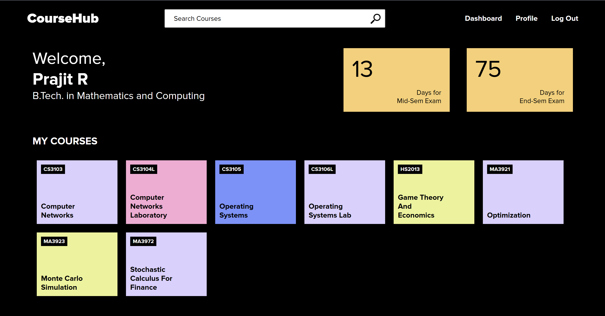
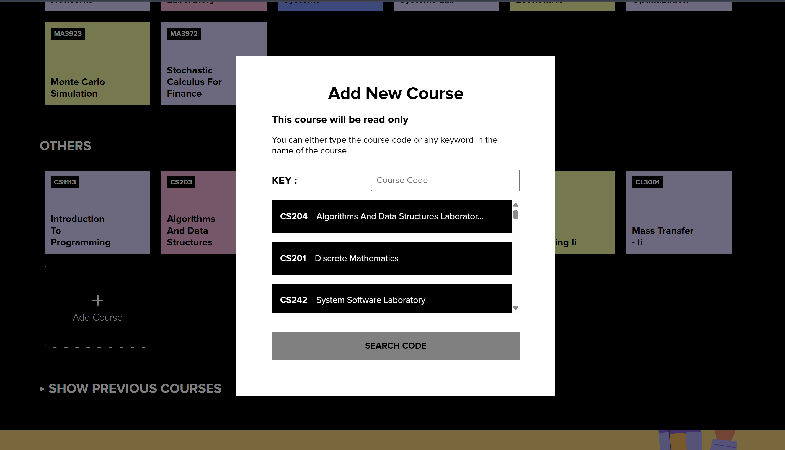
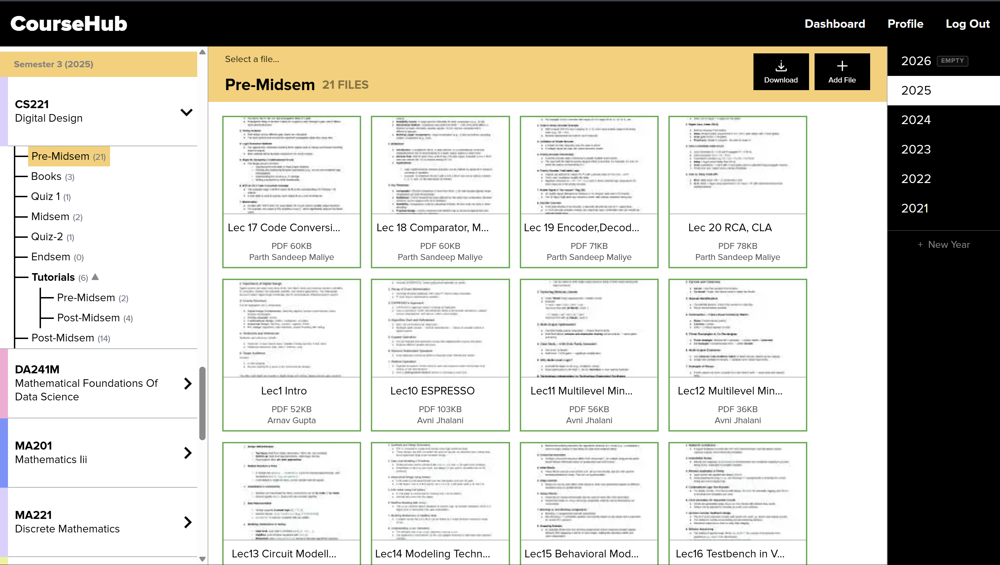
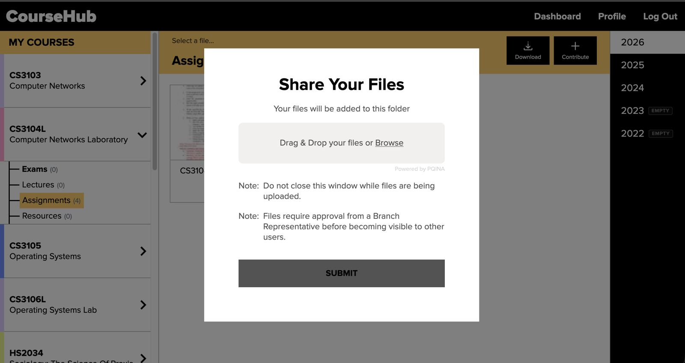
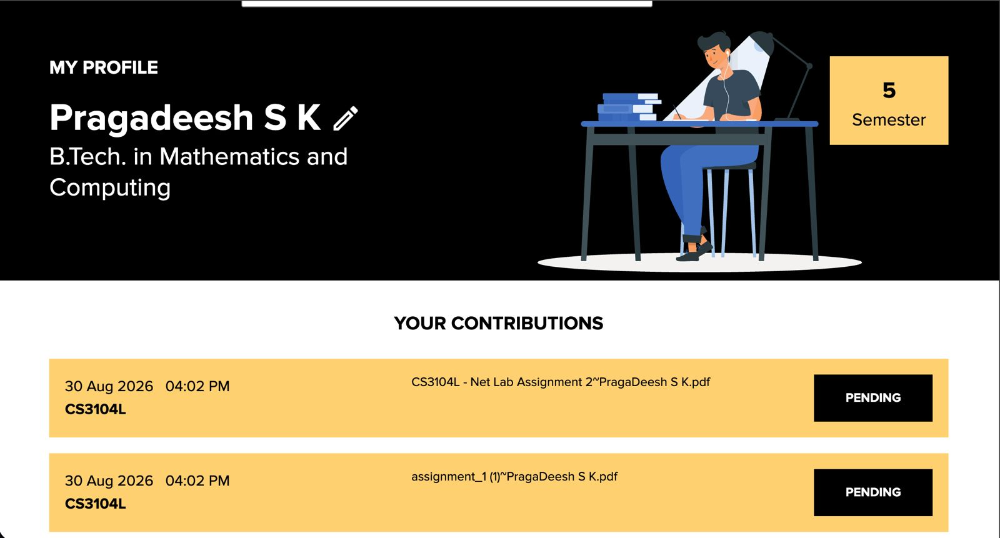
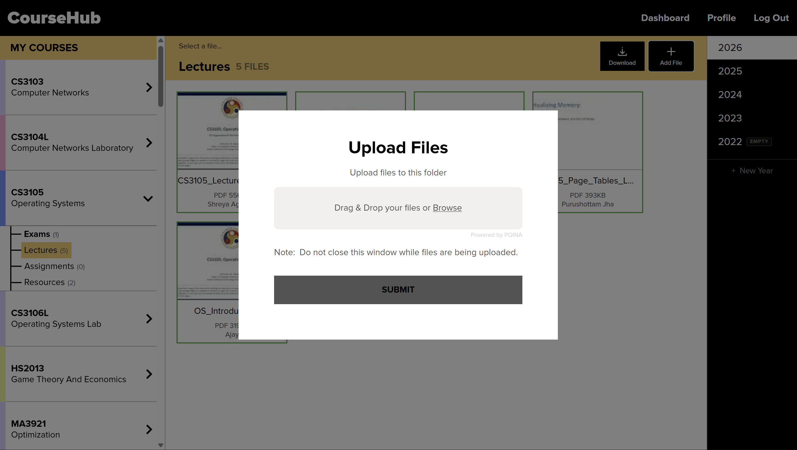
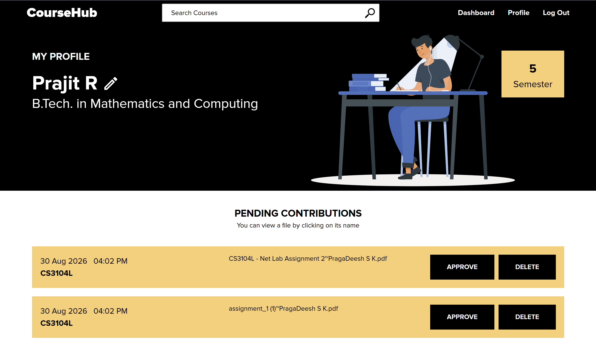
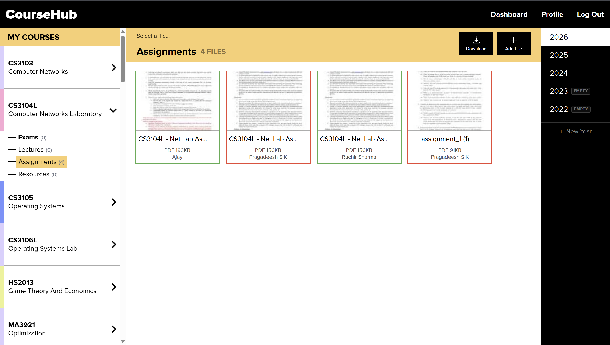
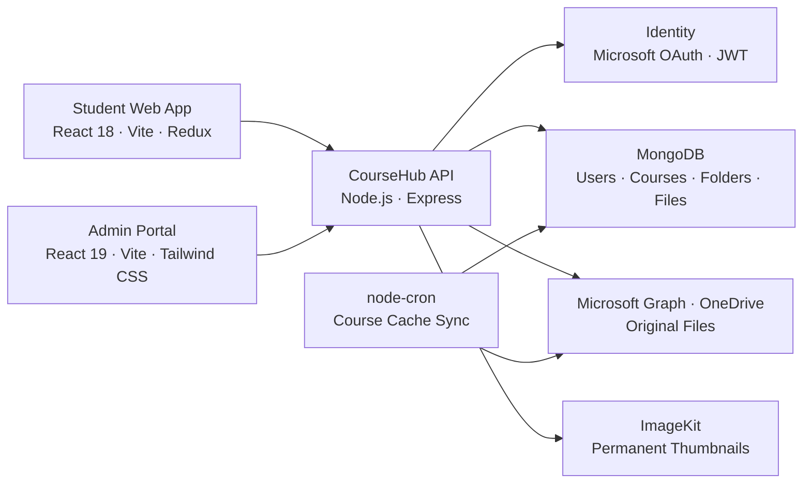

<div align="center">
  
</div>

<h1 align="center">CourseHub</h1>

<p align="center">
  IIT Guwahati's shared academic library
</p>

<p align="center">
  <a href="https://coursehub.codingclub.in"><strong>Open CourseHub</strong></a>
  ·
  <a href="https://codingclub.in/blog/meet-coursehub-find-share-and-organise-course-material">Read the guide</a>
</p>

CourseHub brings IIT Guwahati's scattered course material into one organised, searchable library.
Students can browse resources by course and year, preview or download files, save frequently used material, and contribute resources for their peers.

Branch Representatives (BRs) maintain the structure for their assigned courses and review student contributions before publication.
An administration portal supports student, BR, course, and content management across the platform.

## Features

- **Course-based library** organised as `Course → Year → Folder → File`
- **Microsoft sign-in** using IIT Guwahati institutional accounts
- **Automatic course discovery** from a student's academic registration
- **Search and custom courses** for material outside the current course list
- **File previews, downloads, folder ZIPs, favourites, and shareable links**
- **Student contributions** with a review queue and approval workflow
- **BR tools** for creating years and folders and managing course material
- **Administration portal** for students, BRs, courses, bulk imports, and course linking
- **Shared legacy folders** that let related course codes reuse material without duplication

## Screenshots

<table>
  <tr>
    <td align="center"><strong>Student dashboard</strong></td>
    <td align="center"><strong>Adding another course</strong></td>
  </tr>
  <tr>
    <td>
      
    </td>
    <td>
      
    </td>
  </tr>
  <tr>
    <td align="center"><strong>Course browser and BR controls</strong></td>
    <td align="center"><strong>Student contribution flow</strong></td>
  </tr>
  <tr>
    <td>
      
    </td>
    <td>
      
    </td>
  </tr>
  <tr>
    <td align="center"><strong>Contribution status</strong></td>
    <td align="center"><strong>Direct BR upload</strong></td>
  </tr>
  <tr>
    <td>
      
    </td>
    <td>
      
    </td>
  </tr>
  <tr>
    <td align="center"><strong>Contribution review</strong></td>
    <td align="center"><strong>Folder approval controls</strong></td>
  </tr>
  <tr>
    <td>
      
    </td>
    <td>
      
    </td>
  </tr>
</table>

## System Architecture



<p align="center">
  
  
  
  
  
  
  
  
</p>

### Student Client

The student-facing application is built with React, Vite, Redux, React Router, and SCSS.
It provides the course dashboard, nested file browser, search, favourites, profile, and contribution workflows.
Course trees are cached in the browser to make repeated navigation faster and reduce redundant API requests.

### Administration Portal

The separate administration portal uses React, Vite, and Tailwind CSS.
It supports student and BR management, course dashboards, bulk course imports, course linking, contribution moderation, and course-cache synchronization.

### Backend

The Node.js and Express API owns authentication, authorization, course and file metadata, contribution review, and administration workflows.
MongoDB stores the application data, while Microsoft Graph and OneDrive provide file storage and delivery.
ImageKit stores permanent thumbnails instead of relying on expiring OneDrive preview URLs.

Course allotments are cached in MongoDB after they are resolved from IITG's academic data.
A scheduled job synchronizes the shared course cache each month.

### Roles and Content Workflow

- **Students** browse approved material, add courses, save favourites, and submit files.
- **Branch Representatives** organise assigned courses and review pending contributions.
- **Administrators** manage users, BR assignments, courses, imports, linking, and moderation.

Uploaded student material remains pending until a BR approves it.
This keeps the library useful without requiring the core team to organise every file manually.

## Repository Structure

```text
coursehub/
├── client/   # Student-facing React application
├── admin/    # Administration portal
├── server/   # Express API, jobs, integrations, and data models
├── docs/     # Architecture and implementation notes
└── deploy.sh # Production deployment helper
```

## Local Setup

### Prerequisites

- Node.js 22 or newer
- npm
- MongoDB
- A Microsoft Entra application and Microsoft Graph access
- A OneDrive folder for course material
- ImageKit credentials for permanent thumbnails

### 1. Backend

The API must be running before either frontend can load live data.

```bash
cd server
cp .env.example .env
npm ci
npm run preflight
npm run dev
```

Configure the values documented in `server/.env.example`.

### 2. Student Client

```bash
cd client
cp .env.example .env
npm ci
npm run dev
```

Set `VITE_API_BASE_URL` to the local API origin.

### 3. Administration Portal

```bash
cd admin
cp .env.example .env
npm ci
npm run dev
```

Set `VITE_API_BASE_URL` to the same API origin used by the student client.

## Verification

Run the relevant checks before opening a pull request:

```bash
# Backend
cd server
npm run preflight
npm test

# Student client
cd client
npm run build

# Administration portal
cd admin
npm run lint
npm run build
```

## Workflow

- **`dev`** is the active development branch. Open feature and fix pull requests against it.
- **`prod`** reflects the deployed application and is updated after changes are considered stable.

## Further Reading

- [Usage Guide](https://codingclub.in/blog/meet-coursehub-find-share-and-organise-course-material)
- [Course linking and shared-folder model](./docs/course_link_logic.md)
- [Frontend caching](./docs/frontend-caching.md)

---

Built and maintained by [Coding Club, IIT Guwahati](https://codingclub.in).
